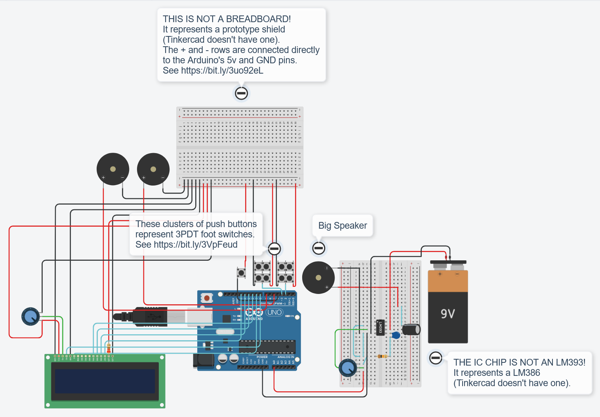
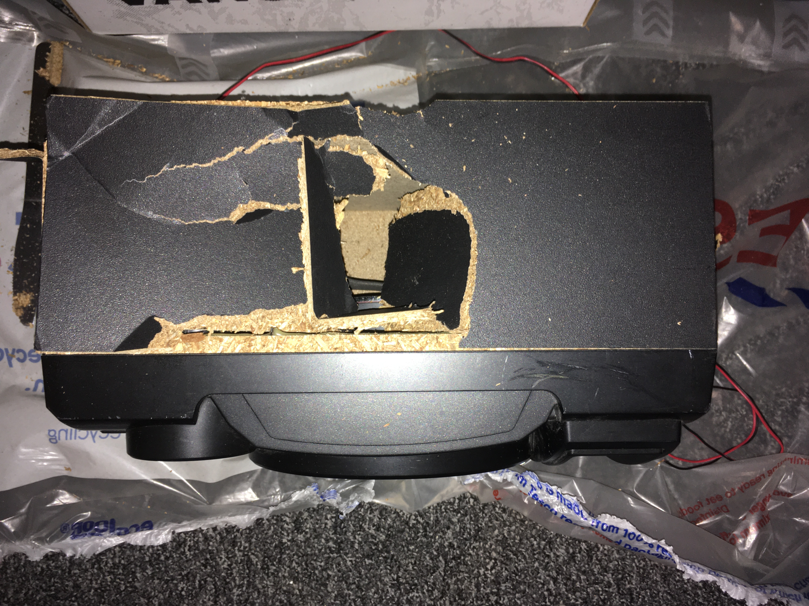
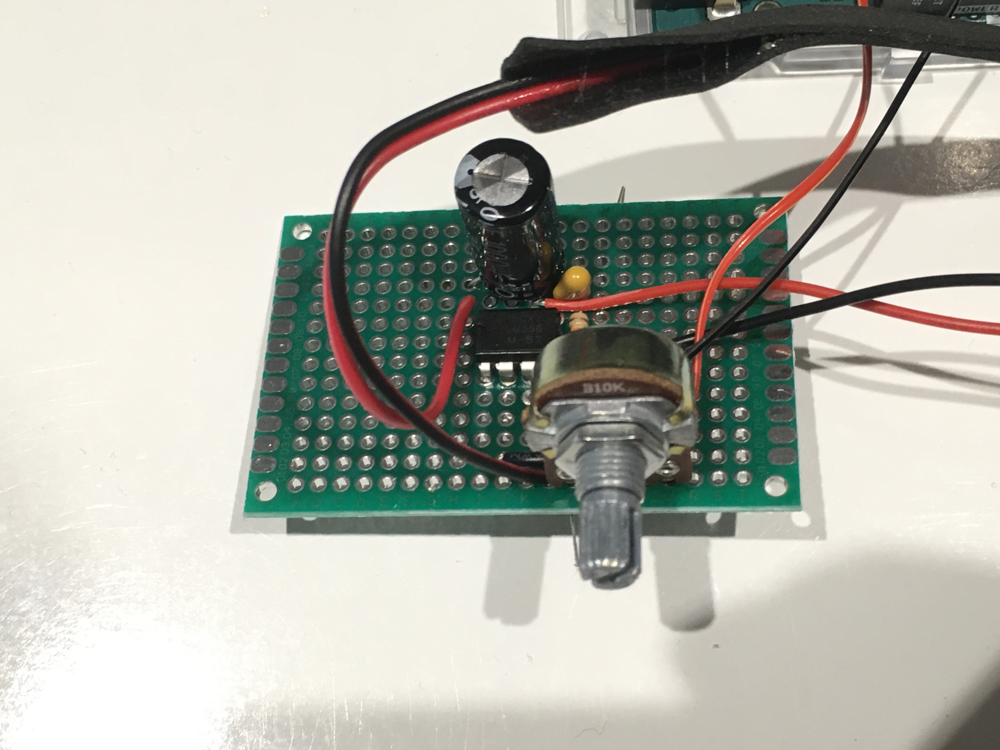
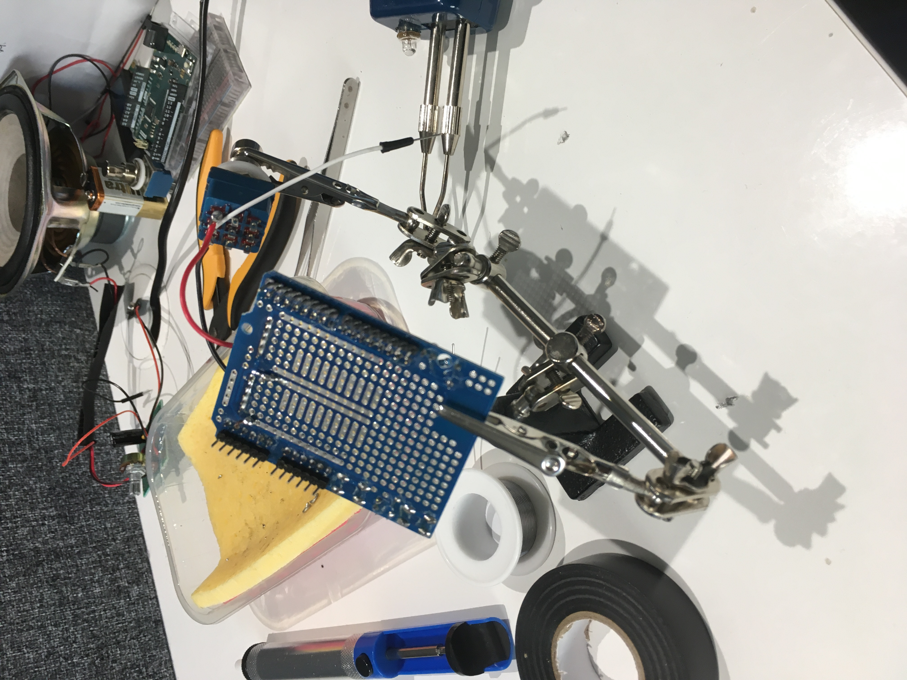
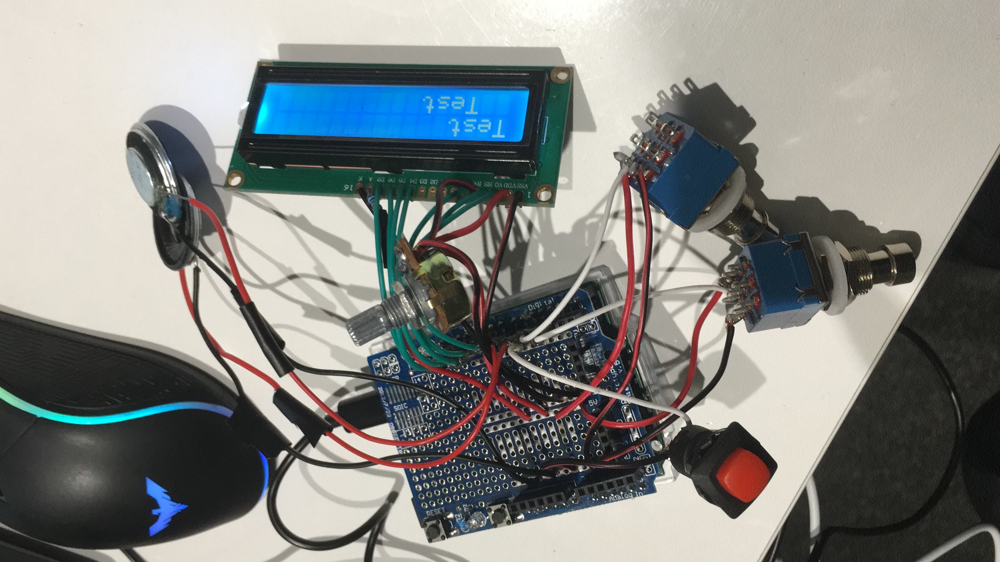
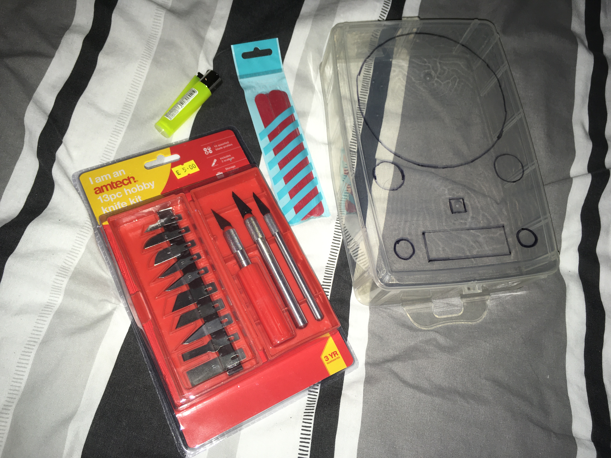
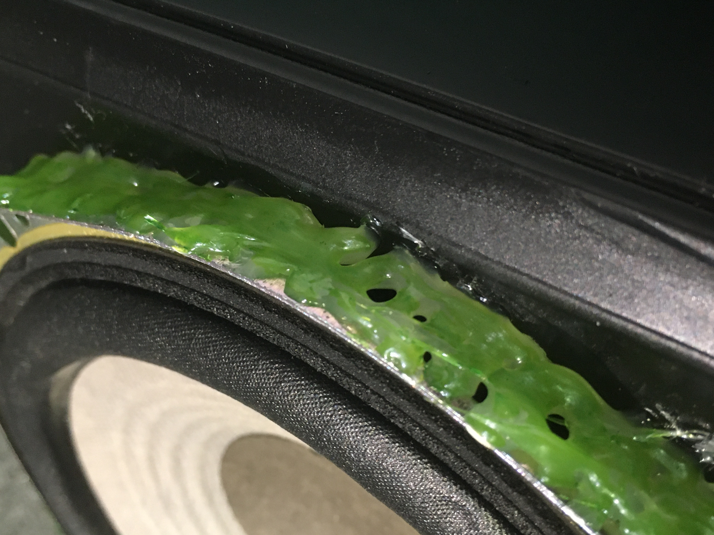

# Introduction

This article describes the steps I took to build my end of term IU000125 project. Below is a link to my presentation (which should be read before moving on to the contents of this page) as well as a circuit diagram of the project as a whole and a copy of the code that was uploaded to my Arduino. Getting a grasp of the diagram should make it easier to understand where each individual part fits in within its wider context. Note that, due to the limitations of Tinkercad, I had to get creative with the diagram. I believe I've made everything as clear as possible, but in case I failed, I'm more than happy to clear up any confusion via email. I can be contacted at g.rudic0520221@arts.ac.uk.

I don't discuss my code much here, for one simple reason: after having undertaken extensive academic and professional training in C, I've learned to "think in C," and coding in C/C++ comes naturally to me; it's like an instinct, and I'd find it hard to describe what exactly went through my mind when I wrote any particular segment. Hopefully, the code comments speak for themselves.

Presentation: [LINK]



(Diagram available at: https://www.tinkercad.com/things/0dd8D33kWMK-pcomp-end-of-term-project/editel?sharecode=Qfmkby5-pRfvcCYfOLX-c3HX9iRfIknGoGUBeGoOcw8)

```
/*
 * Notes:
 * freqs[0 + offset] -> current big speaker frequency
 * freqs[1 + offset] -> current left small speaker frequency
 * freqs[2 + offset] -> current right small speaker frequency
 * if (mars_pos != venus_pos + 1) -> if the mars and venus symbols are not next to each other
 */

#include <LiquidCrystal.h>

// used with helper
#define MARS true
#define VENUS false

// used with recalculatePeriods
#define BIG true
#define ALL false

// setting up/initialising the lcd display
#define RS 8
#define EN 9
#define D4 10
#define D5 11
#define D6 12
#define D7 13
LiquidCrystal lcd(RS, EN, D4, D5, D6, D7);

// setting up/initialising the icon positions
int venus_pos = 0;
int mars_pos = 15;

// setting up the buttons
const int main_btn_pins[] = {2, 3};
int main_btn_states[2];
#define secd_btn_pin 4

// setting up the speakers
const int speaker_pins[] = {A0, 5, 7}; // {big, small (left), small (right)}
float freqs[] = {30.87, 24.50, 36.71, 41.20, 32.70, 49.00}; // first three for preset 1 (CM), next three for preset 2 (GM)
int curr_preset = 1; // current preset
int offset = 0; // used to switch between preset 1 and preset 2
float step = (freqs[2] - freqs[1]) / 10.0; // oscillation steps for the big speaker
bool going_up = true; // true when the big speaker frequency is increasing
float freqs_dup[] = {30.87, 24.50, 36.71, 41.20, 32.70, 49.00}; // backup of original frequencies
float periods[6]; // square wave periods
unsigned long triggers[6]; // see loop

unsigned long last_time = 0; // see loop

void setup() {
  // setting up the icons
  const byte venus[8] = {B11111, B10001, B10001, B11111, B00100, B00100, B01110, B00100};
  const byte mars[8] = {B00111, B00011, B00101, B01000, B11111, B10001, B10001, B11111};
  const byte andro[8] = {B00100, B01110, B10101, B00100, B01110, B00100, B01010, B00100};

  // initialising the lcd display (contd.)
  lcd.createChar(1, venus);
  lcd.createChar(2, mars);
  lcd.createChar(3, andro);
  lcd.begin(16, 2);
  lcd.write(1);
  lcd.setCursor(15, 0);
  lcd.write(2);

  // initialising the buttons
  for (int i = 0; i < 2; i++) {
    pinMode(main_btn_pins[i], INPUT);
    main_btn_states[i] = digitalRead(main_btn_pins[i]);
  }
  pinMode(secd_btn_pin, INPUT_PULLUP);

  // initialising the speakers
  for (int i = 0; i < 6; i++) {
	  pinMode(speaker_pins[i], OUTPUT);
    periods[i] = (1.0 / freqs[i]) * 1000000; // equation derived from https://www.tinkercad.com/things/1Ney4yiUqCl-arduino-speaker
    triggers[i] = 0;
  }
}

void loop() {
  // checking for main button inputs
  // by monitoring state changes
  for (int i = 0; i < 2; i++) {
    if (digitalRead(main_btn_pins[i]) != main_btn_states[i]) {
      if (main_btn_states[i])
        main_btn_states[i] = LOW;
      else
        main_btn_states[i] = HIGH;
      moveSymbol(bool(i));
    }
  }
  
  // checking for secondary button input
  if (digitalRead(secd_btn_pin) == LOW)
    changePreset();

  // playing each speaker's frequency
  unsigned long curr_time = micros();
  for (int i = 0; i < 3; i++) {
    if (curr_time >= triggers[i + offset]) {
      if (digitalReadOutputPin(speaker_pins[i]) == LOW) {
        digitalWrite(speaker_pins[i], HIGH);
      } else {
        digitalWrite(speaker_pins[i], LOW);
      }
      triggers[i + offset] = micros() + int(periods[i + offset] / 2.0);
    }
  }
  
  // oscillating the big speaker's frequency (when applicable)
  if (mars_pos != venus_pos + 1) {
    if (curr_time - last_time >= 50000) { // run every 50000μs
      if (going_up) {
        if (freqs[0 + offset] < helper(MARS)) {
          freqs[0 + offset] += step;
          recalculatePeriods(BIG);
        } else {
          freqs[0 + offset] -= step;
          recalculatePeriods(BIG);
          going_up = false;        
        }
      } else {
        if (freqs[0 + offset] > helper(VENUS)) {
          freqs[0 + offset] -= step;
          recalculatePeriods(BIG);
        } else {
          freqs[0 + offset] += step;
          recalculatePeriods(BIG);
          going_up = true;        
        }
      }
      last_time = curr_time;
    }
  } else {
    if (freqs[0 + offset] != freqs_dup[0 + offset]) {
      freqs[0 + offset] = freqs_dup[0 + offset];
      recalculatePeriods(BIG);
    }
  }
}

// moves the mars and venus symbols appropriately.
// if they are next to each other,
// displays the androgyny symbol.
void moveSymbol(bool flag) {
  if (flag) {
    mars_pos--;
    if (mars_pos == 7)
      mars_pos = 15;
  } else {
    venus_pos = (venus_pos + 1) % 8;
  }

  if (mars_pos != venus_pos + 1) {
    lcd.clear();
    lcd.setCursor(venus_pos, 0);
    lcd.write(1);
    lcd.setCursor(mars_pos, 0);
    lcd.write(2);
  } else {
    for (int i = 0; i < 2; i++) {
      for (int j = 0; j < 16; j++) {
        lcd.setCursor(j, i);
        lcd.write(3);
      }
    }
  }
}

// changes the current preset
void changePreset() {
  if (curr_preset == 1)
    curr_preset = 2;
  else
    curr_preset = 1;

  if (offset == 0)
    offset = 3;
  else
    offset = 0;

  recalculatePeriods(ALL);

  step = (freqs[2 + offset] - freqs[1 + offset]) / 10.0;

  venus_pos = 0;
  mars_pos = 15;

  lcd.clear();
  lcd.setCursor(0, 0);
  String message = String("Preset ") + String(curr_preset);
  lcd.print(message);

  delay(1000);

  lcd.clear();
  lcd.setCursor(venus_pos, 0);
  lcd.write(1);
  lcd.setCursor(mars_pos, 0);
  lcd.write(2);
}

// function from https://forum.arduino.cc/t/how-to-find-out-output-pin-state/42066/2
int digitalReadOutputPin(uint8_t pin) {
  uint8_t bit = digitalPinToBitMask(pin);
  uint8_t port = digitalPinToPort(pin);
  return (*portOutputRegister(port) & bit) ? HIGH : LOW;
}

// helps set the range of frequencies the main speaker oscillates between (when applicable)
float helper(bool flag) {
  if (flag) {
    float perc = (mars_pos - 9.0) / (15.0 - 9.0); // mars_pos - min mars pos / max mars pos - min mars pos
    return freqs_dup[0 + offset] + freqs[2 + offset] * perc;
  } else {
    float perc = venus_pos / 8.0; // venus_pos / max venus pos
    return freqs_dup[0 + offset] - freqs[1 + offset] * perc;
  }
}

// recalculates the period of the main speaker if flag == true (BIG).
// otherwise (ALL), recalculates all the periods.
void recalculatePeriods(bool flag) {
  if (flag) {
    periods[0 + offset] = (1.0 / freqs[0 + offset]) * 1000000;
    triggers[0 + offset] = 0;
  } else {
    for (int i = 0; i < 6; i++) {
      freqs[i] = freqs_dup[i];
      periods[i] = (1.0 / freqs[i]) * 1000000;
      triggers[i] = 0;
    }
  }
}
```

# The Speakers

Building the part of my project centered around the big speaker proved to be difficult in many ways.

The big, central speaker in my device originates from a Sony SS-EC69i. To extract the relevant component from the Sony SS-EC69i, I initially tried to open the latter with a screwdriver, a hammer, and a hair dryer (it was sealed with glue rather than screws, much to my dismay). After a good hour or two or trying to open it this way, I gave up and started looking for alternative solutions. I then came across [this video](https://www.youtube.com/watch?v=jViMVnf3Txc "How to open sealed speakers"), which lead me to furiously stomp the Sony SS-EC69i until I smashed my foot through its side. This worked perfectly.



My struggles were only beginning however, as the speaker was fairly small, and both my hands and my tools were not. Eventually, I succeeded in getting the component out.

I then began to build the amplifier circuit connected to the speaker, which presented a new set of frustrating challenges. Firsly, since I like working from home, I purchased a Draper 71421 230-Volt Soldering Kit to do the soldering for my project in my room. During my first attempt, I discovered that the soldering iron included in the kit was essentially useless, and that I'd have to use the bulky soldering gun instead. Secondly, I soldered a grand total of three amplifier circuits, two of which I'd find out were wired incorrectly. While building the third one, which would eventually work, I created more cold connections than I can count.

In the end, I got everything to work.

The small speakers, thankfully, could be connected directly to the Arduino. However, an error in my code would lead me to believe that one of them was improperly soldered. After de-soldering and re-soldering it a couple of times, I caught on to the fact that something was off with my code, and fixed my mistake.

# The Buttons/Switches

Before I began wiring up my buttons, I decided to design the keycaps that would lay on top of my 3PDT foot switches. Initially, I wanted to design them in FreeCAD, since I felt that this was the "correct" way of doing it. I read FreeCAD's official beginner's manual, and began working on my designs. I spent many hours doing this, but eventually gave up after encountering countless frustrating errors only to find out on the FreeCAD forums that "it's just something you have to put up with."

I then switched to Blender—which I had a fair amount of prior experience with—and managed to design the keycaps in... 5 or 10 minutes.

It's important to mention that my designs are based on an existing 3D model and an existing set of SVGs, which are linked below.

[Base Mesh Keycap](https://www.cgtrader.com/free-3d-print-models/games-toys/game-accessories/base-mesh-keycap "Base Mesh Keycap")

[Planets Signs SVG - Astrological Symbols Cut File](https://designbundles.net/redhelgaart/1458960-planets-signs-svg-planet-symbols-svg-astrological-#gtmList=30&gtmPos=1 "Planets Signs SVG - Astrological Symbols Cut File")

I undertook a 3D printing induction with Colin, and printed my keycaps.

I then soldered my 3PDT foot switches to my prototype board, but I didn't get it right the first time. The first thing I types in a search engine to find out how to wire them was "3PDT foot switch pinout" (notice that I didn't use the "Arduino" keyword). I found a variety of diagrams online, some of which were different than others. While testing different configurations, I believe I accidentally got one of my breadboard wires to touch two terminals of the switch I was using, because I wired it incorrectly and yet found it to work fine. I discovered this the hard way: after soldering both of the switches to my prototype board, I realised something was wrong. Eventually, I searched for "3PDT foot switch Arduino" and found the correct way to wire them.

The preset button doesn't deserve much attention; it's fairly simple and everything went smoothly with it.

# The LCD Display

Unlike large speakers or 3PDT foot switches, using LCD displays with the Arduino is a very well-documented process. By the time I got around to soldering wires onto my display, and my display onto my prototype board, I'd gotten fairly comfortable with soldering. This made things a lot easier. That's not to say it was easy (it's never easy to solder something with this many wires), but in this case I didn't struggle as much as I had with the other components. Designing the icons for the LCD display was a lot of fun, and with tool such as [HD44780 LCD User-Defined Graphics](https://www.quinapalus.com/hd44780udg.html "HD44780 LCD User-Defined Graphics"), it was painless as well.

# The Housing

Designing the case for my device was a test of patience. I started off with the top of a box I had lying around in my room, and cut shapes through it with an exacto knife that I heated up with a lighter to make the cutting easier (cutting through plastic with a cold blade is hard). It's a long and highly repetitive process (heat, poke, repeat). I then sanded some of the edges with a nail file. Once the cutting and sanding was over, I spray painted the box black, and it was ready for the next step.

I secured the components onto the case with hot glue, but added a significant twist: I coloured the hot glue with a green sharpie. This wasn't just for fun; it's a major contributor to the sci-fi look I was aiming for.

# Concluding Remarks

The preceding paragraphs are only a brief, concise description of the process I went through. I made so many mistakes with each component I couldn't have possibly kept track of them all, and I also tested some additional components that didn't make it to the final project (which took up a large chunk of my time). In addition, I spent a fair amount of time researching ideas before I even started working on my project, as well as researching the theory behind what I was doing.

# Gallery

    
